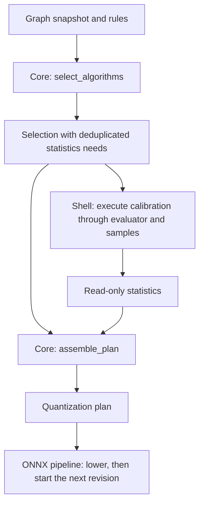

# Algorithms: functional core and imperative shell

An algorithm receives a graph snapshot and already collected statistics. It
returns decisions: which input edges to quantize, their scales and zero points,
or which channels to rescale. You can test those decisions without loading an
ONNX model, executing inference, downloading data, or creating files.

For example, SmoothQuant with `alpha=0.5`, activation magnitudes `[4, 9]`, and
unit weight magnitudes produces scales `[2, 3]`. The activation edge is divided
by these scales and the weight channels are multiplied by them. The floating
computation is preserved; a later stage recalibrates before quantization.

## Where the boundary lives

| File | Responsibility |
| --- | --- |
| [`contracts.py`](contracts.py) | `Algorithm`, `Needs`, and owned read-only `Statistics` |
| [`core.py`](core.py) | Pure `select_algorithms(graph, rules)` and `assemble_plan(selection, stats)` |
| [`encoding.py`](encoding.py) | Pure affine scale and zero-point calculation |
| [`static.py`](static.py) | Static W8A8 decisions from graph weights and supplied statistics |
| [`smoothquant.py`](smoothquant.py) | Channel balancing decisions from graph weights and supplied statistics |
| [`shell.py`](shell.py) | `build_plan`: invoke calibration through an injected evaluator/sample factory |
| [`../backends/onnx/pipeline.py`](../backends/onnx/pipeline.py) | Choose ORT execution, lower each revision, and calibrate subsequent stages |



`Selection` carries the graph used during rule resolution. Assembly does not
accept a second graph that could accidentally differ. Statistics must still
belong to that revision; the current API does not fingerprint their provenance.
Frozen models and owned read-only mappings/arrays prevent ordinary accidental
mutation. Open algorithm and selector plugins must honor their pure contracts;
Python cannot enforce purity of arbitrary implementations.

## Unit-test an algorithm

Start with the complete two-channel test in
[`tests/algorithms/test_smoothquant.py`](../../../tests/algorithms/test_smoothquant.py).
It builds a tiny domain graph, supplies known statistics, calls `.plan()` directly,
and checks the actual scale values. There is no evaluator or calibration source.

The essential call is:

```python
plan = expect_ok(SmoothQuant(alpha=0.5).plan(node, graph, stats))
```

`expect_ok` is a test assertion helper: it reports a failed Result with its
structured diagnostic. Production callers handle `Err` explicitly.

To test the whole decision stage from supplied statistics:

```python
from qraft.algorithms import Algorithm, assemble_plan, select_algorithms
from qraft.algorithms.static import StaticW8A8
from qraft.rules import Rules

rules: Rules[Algorithm] = Rules(default=StaticW8A8())
selection = expect_ok(select_algorithms(graph, rules))
plan = expect_ok(assemble_plan(selection, stats))
```

This path performs no calibration. `selection.needs` tells you which statistics
to supply; range requests include first-pass bounds required for histograms.
`assemble_plan` combines patches, retains exclusions, and rejects conflicting
operations. The algorithm tests verify those behaviors with real algorithms.

From the project root:

```sh
just test-algorithms
just test-algorithms -k two_channel_example
```

The target excludes the parent ONNX integration fixtures from pytest discovery.
Its tests use NumPy and typed domain records; shell tests use in-memory execution
dependencies. See the [test guide](../../../tests/algorithms/README.md) for cases
and the direct uv command. `just check` also runs the real ONNX Runtime integration
tests and Torch export examples.

## Extending an algorithm

Implement `requirements(node, graph) -> Result[Needs, QraftError]` and
`plan(node, graph, stats) -> Result[QuantizationPlan, QraftError]`. Put the complete
algorithm in a new module and select it through `Rules[Algorithm]`. Neither the
core nor shell switches on concrete algorithm types.

Import the local `Result`, `Ok`, and `Err` from `qraft.result`. Qraft supplies the
frozen Pydantic `QraftError` payload. Expected layout, data, and planning failures
return `Err`; constructor validation and unexpected plugin exceptions retain
their exception behavior.

The statistics contract supports extrema and histograms. GPTQv2 and QDrop use a
separate [reconstruction contract](../reconstruction/README.md) with paired replay;
they do not add execution dependencies to this pure planning interface.
