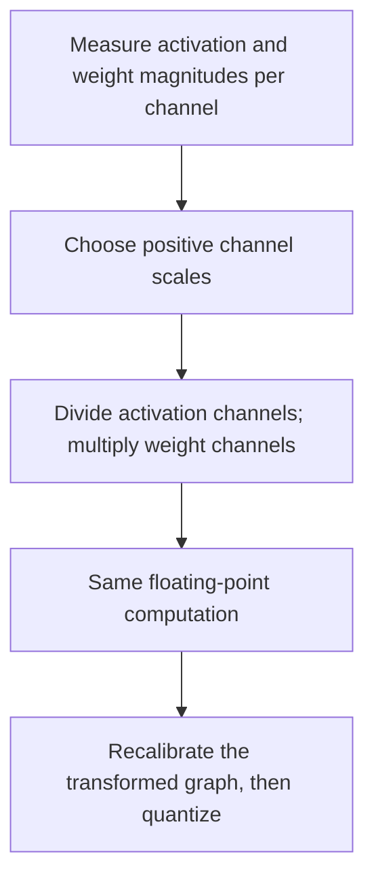

# SmoothQuant

Move some numerical range from difficult activation channels into their paired
weights before quantizing. An activation of `100` multiplied by a weight of
`0.01` gives `1`. Divide the activation by `100` and multiply the weight by `100`:
the new values are `1` and `1`, and the product is still `1`.



For activation magnitude `a` and weight magnitude `w`, Qraft uses
`s = a^alpha / w^(1 - alpha)`. With `a=100`, `w=0.01`, and `alpha=0.5`, this gives
`s=100`, as above. The parameter controls how much range moves between the pair.

```python
from qraft.algorithms.smoothquant import SmoothQuant

method = SmoothQuant(alpha=0.5)
```

**In Qraft:** smoothing is a separate transformation stage for supported matrix
operators and ungrouped Conv. Dead channels use scale 1. It preserves shared
consumers and requires fresh calibration after lowering; smoothing alone does
not quantize anything.

**Intuition check:** SmoothQuant redistributes channel magnitudes while preserving
the floating-point function. It does not remove outliers by clipping them.

## References

- Xiao et al., [SmoothQuant: Accurate and Efficient Post-Training Quantization
  for Large Language Models](https://proceedings.mlr.press/v202/xiao23c.html), ICML 2023.
- [Authors' implementation](https://github.com/mit-han-lab/smoothquant).
- [Qraft implementation](./__init__.py); its generic edge-local transforms do not
  claim to reproduce the paper's complete LLM deployment and kernel pipeline.
