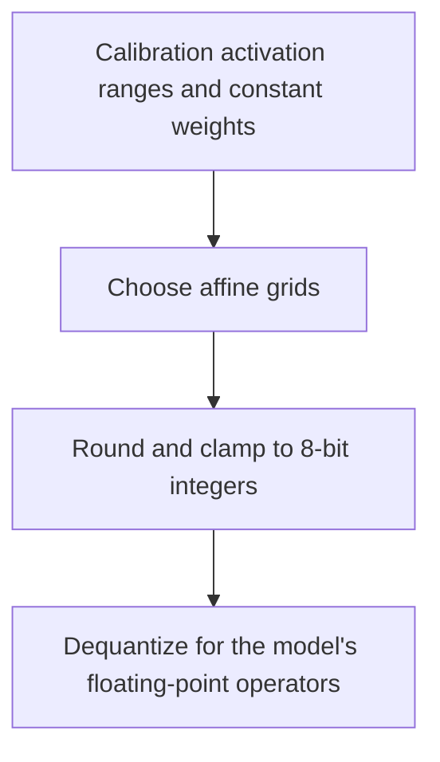

# Static W8A8

Choose a fixed integer grid for weights and activations before inference. Given
scale `0.1` and zero point `0`, the value `0.26` becomes integer `3`, which restores
to `0.30`. That `0.04` difference is the rounding error we want to keep small.



For each grid, `q = clamp(round(x / scale) + zero_point)` and the restored value
is `(q - zero_point) * scale`. Zero is always representable. Qraft uses one grid
per activation tensor and one per output weight channel. MinMax or Percentile
chooses the activation interval; weight grids use their observed extrema.

```python
from qraft.algorithms.static import StaticW8A8

method = StaticW8A8()
```

**In Qraft:** this produces consumer-local QDQ plans for constant-weight Conv,
MatMul, and Gemm. Bias stays floating point. QDQ does not itself guarantee an
integer-only kernel, a smaller model, or faster inference.

**Intuition check:** static quantization fixes the ruler before inference;
calibration decides its range, and rounding chooses the nearest mark.

## References

- Jacob et al., [Quantization and Training of Neural Networks for Efficient
  Integer-Arithmetic-Only Inference](https://arxiv.org/abs/1712.05877), CVPR 2018:
  affine integer representation background. Qraft does not implement that paper's
  quantization-aware training or integer-only execution pipeline.
- [ONNX QuantizeLinear specification](https://onnx.ai/onnx/operators/onnx__QuantizeLinear.html):
  exported rounding, saturation, and scale semantics.
- [Implementation](./__init__.py).
