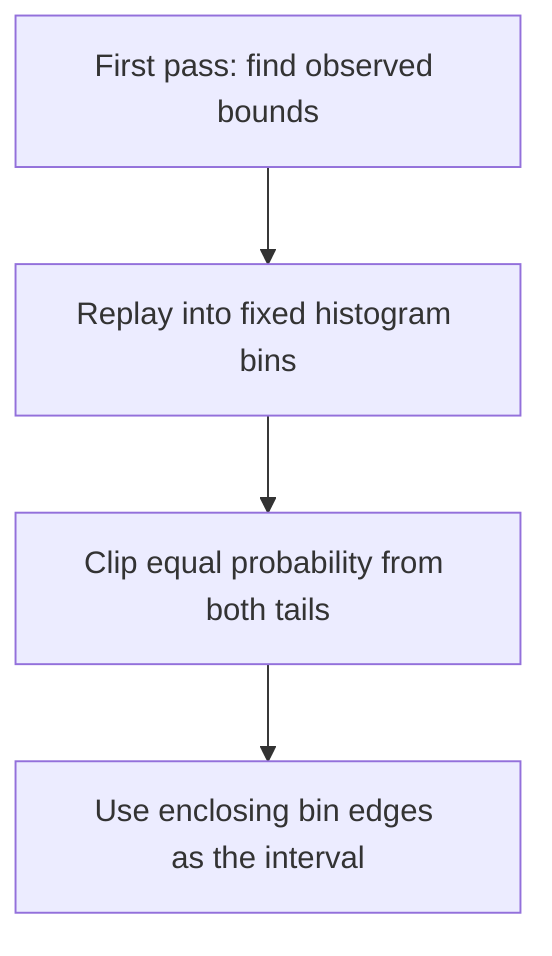

# Percentile

Trade coverage of rare extremes for finer resolution where most values lie.
Imagine a histogram with 5 observations in `[-10, -2)`, 990 in `[-2, 2)`, and
5 in `[2, 10]`. A 99% central interval clips 0.5% from each tail and selects
`[-2, 2]`. The later quantizer can use a much narrower grid than MinMax's `[-10, 10]`.



**In Qraft:** clipping uses histogram bin edges, not exact sorted quantiles.
Memory depends on the number of bins, not the dataset length. Replay must
reproduce the calibration data. A percentile of 100 preserves the extrema.
This policy currently supports per-tensor histograms.

```python
from qraft.calibration import Percentile

method = Percentile(percentile=99.0)
```

**Intuition check:** Percentile asks “which central interval covers this fraction
of observations?” It does not optimize the network's task accuracy.

## References

- [ONNX Runtime: static quantization and calibration methods](https://onnxruntime.ai/docs/performance/model-optimizations/quantization.html#static-quantization)
  documents percentile calibration. Qraft's equal-tail, enclosing-bin policy is
  defined by its own implementation; it is not a reproduction of every runtime's
  percentile estimator.
- [Implementation](./__init__.py) and [histogram collection](../__init__.py).
