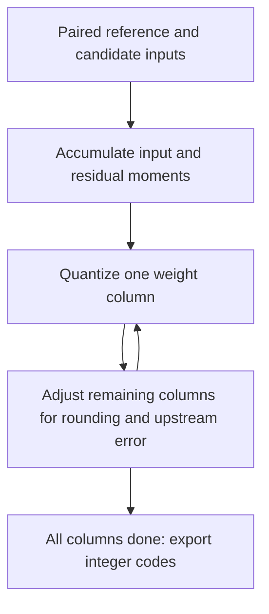

# GPTQv2

Reconstruct each layer against the original model, including errors introduced
by earlier quantized layers. Suppose reference inputs `[1, 1]` and weights
`[1, 1]` produce `2`. Earlier quantization changes the inputs to `[0.8, 1]`, so
unchanged weights produce `1.8`. A later weight of `1.2` could recover `2` on this
sample if the quantization grid permits it. Calibration seeks such compensation
across many samples, not an exact fit to this illustrative single sample.



**In Qraft:** input Gram statistics describe which channels can compensate for
one another. Residual cross-moments describe how reference inputs differ from
candidate inputs. Damped linear algebra supplies the column updates without
gradient descent. Memory grows with input width squared, not sample count.

```python
from qraft.reconstruction.gptqv2 import GPTQv2

method = GPTQv2(damping=0.01)
```

This implementation uses unblocked NumPy/CPU updates and W8A8 affine grids for
constant rank-two MatMul weights or Gemm with `alpha=1`. It targets Algorithm 1
of the **v1 paper**, not later GPTAQ revisions or the authors' optimized GPU path.
It is not guaranteed to improve every model; Qraft's projection demo ties MinMax.

**Intuition check:** GPTQv2 measures error relative to the original computation,
so earlier quantization errors remain visible instead of becoming the new target.

## References

- Li et al., [GPTQv2: Efficient Finetuning-Free Quantization for Asymmetric
  Calibration](https://arxiv.org/abs/2504.02692v1), 2025; Algorithm 1 and Section 4.
- Frantar et al., [GPTQ: Accurate Post-Training Quantization for Generative
  Pre-trained Transformers](https://arxiv.org/abs/2210.17323), ICLR 2023:
  the underlying columnwise rounding-compensation method.
- [Authors' repository, now GPTAQ](https://github.com/Intelligent-Computing-Lab-Panda/GPTAQ).
- [Qraft implementation](./__init__.py).
