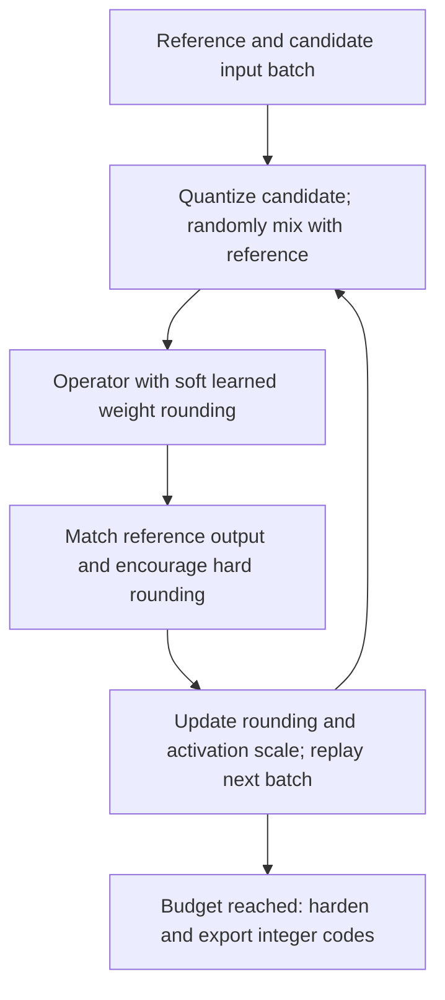

# QDrop-based reconstruction

Learn rounding decisions that work with a mixture of clean and quantized inputs.
Suppose reference activations are `[0.26, 0.74]` and quantized candidates restore
to `[0.3, 0.7]`. With probability `0.5` of keeping each quantized element, one
training step might see `[0.3, 0.74]` and another `[0.26, 0.7]`. The target output
always comes from the floating-point reference.



Qraft uses AdaRound's soft rounding relaxation and an LSQ-style normalized
activation-scale gradient. Rounding regularization begins after warmup, then its
temperature decays. Dropout uses a local random generator. At inference, selected
activation edges always use quantization, with no random mixing.

```python
from qraft.reconstruction.qdrop import QDrop

method = QDrop(steps=2000, keep_probability=0.5, seed=0)
```

**In Qraft:** this is an operator-level W8A8 adaptation for linear operators and
Conv2d, requiring the optional Torch dependency. It replays batches instead of
caching activations. It does not discover residual blocks, learn zero points,
or reproduce the paper's minibatch schedule. Lower relaxed loss need not improve
hard-output accuracy; the projection demo's MSE regresses relative to MinMax.

**Intuition check:** randomly dropping quantization during reconstruction exposes
rounding decisions to several input-error patterns, rather than just one.

## References

- Wei et al., [QDrop: Randomly Dropping Quantization for Extremely Low-bit
  Post-Training Quantization](https://arxiv.org/abs/2203.05740), ICLR 2022.
- [Authors' reconstruction implementation](https://github.com/wimh966/QDrop/blob/qdrop/qdrop/solver/recon.py).
- Nagel et al., [Up or Down? Adaptive Rounding for Post-Training
  Quantization](https://proceedings.mlr.press/v119/nagel20a.html), ICML 2020:
  soft weight rounding and its regularization.
- Esser et al., [Learned Step Size Quantization](https://arxiv.org/abs/1902.08153),
  ICLR 2020: background for normalized scale learning. Qraft uses an LSQ-style
  surrogate in PTQ, not the paper's full QAT recipe.
- [Qraft implementation](./__init__.py).
