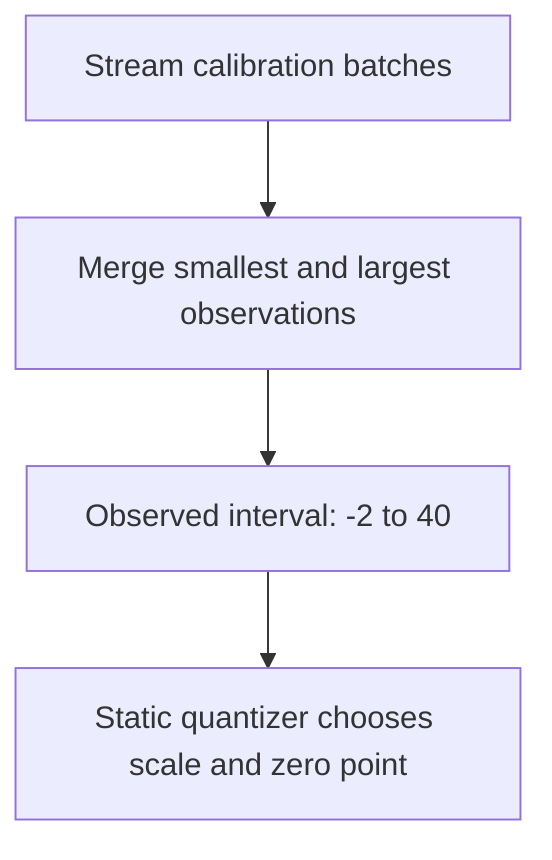

# MinMax

Keep the smallest and largest values seen during calibration. For observations
`[-2, 0, 3, 40]`, the interval is `[-2, 40]`. The rare value `40` gets covered,
but it also spreads the quantization grid over a much wider range.



**In QuantSmith:** `MinMax.interval` returns the supplied extrema unchanged. Collection
keeps aggregate bounds, not the dataset. No histogram or second pass is needed.
The later encoding step includes real zero even when all observations share a sign.

```python
from quantsmith.calibration import MinMax

method = MinMax()
```

**Intuition check:** MinMax asks “how wide must the interval be to cover everything
we observed?” It does not measure how frequently those extremes occur.

## References

- [ONNX Runtime: static quantization and calibration methods](https://onnxruntime.ai/docs/performance/model-optimizations/quantization.html#static-quantization)
  documents MinMax as a standard calibration method; this is not attribution to
  a single originating paper or a claim of implementation equivalence.
- [Implementation](./__init__.py) and [shared collection](../__init__.py).
