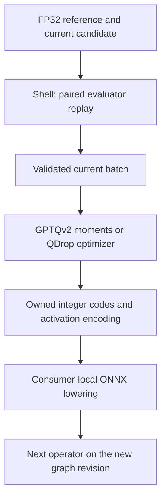

# Reconstruction-based PTQ

Reconstruction pairs inputs from a floating-point reference with inputs from the
graph whose preceding operators have already been quantized. The ONNX shell
lowers each completed operator before calibrating the next one.

## Methods and scope

| Method | Implementation | ONNX scope |
| --- | --- | --- |
| [GPTQv2](gptqv2/README.md) | NumPy implementation of asymmetric residual correction, Algorithm 1 of [arXiv:2504.02692v1](https://arxiv.org/html/2504.02692v1), with unblocked column updates | Constant rank-two MatMul weights; Gemm with `alpha=1`, including both transposes |
| [QDrop](qdrop/README.md) | Adaptive weight rounding, stochastic elementwise reference/quantized-input mixing, learned activation scale, annealed rounding regularization | The same matrix operators; explicit-padding Conv2d, including grouped/depthwise convolution |

The upstream GPTQv2 repository now redirects to GPTAQ. This implementation targets
the named paper revision, not subsequent GPTAQ changes.

QDrop is an **operator-level adaptation**, not a reproduction of its residual-block
benchmark. It uses deterministic streamed replay instead of cached, randomly
sampled minibatches. There is no automatic block discovery, fused activation
reconstruction, or optimization of zero points. Its basis is
[QDrop](https://arxiv.org/abs/2203.05740) and the
[authors' implementation](https://github.com/wimh966/QDrop/blob/qdrop/qdrop/solver/recon.py).

Both methods export the existing INT8/UINT8 affine formats (W8A8), not packed
INT4/INT2. Published low-bit accuracy and production speedups are not established
here. PD-Quant remains an evaluation reference, not an implemented method.

## Architecture



`Problem`, `Batch`, and `Solution` validate and own native arrays. This component
has no ONNX or filesystem dependencies. `Reconstructor` is the extension contract;
the existing pure `Algorithm` protocol remains unchanged. `replay.py` invokes
injected evaluators and a sample factory. Layout conversion, rules, and plan
creation live in [`backends/onnx/reconstruction.py`](../backends/onnx/reconstruction.py).

GPTQv2's weight update is pure. Moment accumulation, QDrop optimization/RNG, and
replay form the imperative shell. QDrop's forward, rounding, and loss helpers
operate on supplied tensors; randomness uses a local generator.

## Usage

```python
from quantsmith.backends.onnx.reconstruction import reconstruct
from quantsmith.reconstruction import Reconstructor
from quantsmith.reconstruction.gptqv2 import GPTQv2
from quantsmith.rules import ByName, Exclude, Rule, Rules

rules: Rules[Reconstructor] = Rules(
    default=Exclude(reason="outside selected projections"),
    overrides=(Rule(selector=ByName(pattern="*projection*"), decision=GPTQv2()),),
)
outcome = reconstruct(model, samples, rules)
```

Use the same `Ok`/`Err` handling as the static pipeline. Select actual
constant-weight operator names; dynamic attention MatMuls are unsupported.
Rules may mix methods. Import `QDrop` from `quantsmith.reconstruction.qdrop`; it requires
the optional `qdrop` package extra. GPTQv2 and the ONNX entry point do not import Torch.

`QuantizationConfig` controls initial MinMax/Percentile grids, storage types,
and symmetry. `smoothquant=True` smooths first, then collects fresh reconstruction
statistics. Smoothing retains its existing operator scope; reconstruction rules
govern the subsequent reconstruction phase.

`GPTQv2(damping=..., max_workspace_bytes=...)` checks its estimated quadratic
workspace before collecting statistics. Memory is O(input_channels²), plus
weights and the current batch. It uses float64 moments and CPU linear algebra,
not the paper's optimized GPU implementation.

`QDrop(steps=..., seed=..., device="cpu", keep_probability=...)` exposes the
optimization budget and stochastic policy. Probability 0 uses reference inputs;
1 uses quantized candidate inputs; 0.5 mixes them elementwise. Learning rates,
warmup, regularization, and temperature endpoints are explicit fields. CUDA is
opt-in; ONNX calibration remains on CPU.

The caller controls dataset limits, sample order, and batch size. No method
materializes the dataset or caches activations. QDrop recomputes paired inputs,
trading execution time for bounded memory, and stops at exactly its step budget.
GPTQv2 needs a finite calibration pass. Factories must replay the same samples.

## Export and checks

`QuantizeConstant` owns exact integer codes and lowers to an integer initializer
plus `DequantizeLinear`. Other consumers of the original constant remain intact.
Unused original initializers are retained, so this is not a file-size optimization.
Activation edges still use QDQ. Plans apply in order to successive graph revisions.

Tests compare GPTQv2 with independent constrained solves, verify hard-output
improvement on controlled cases, and compare ONNX execution with native numerical
computation. They also cover ownership, memory retention, replay budgets,
failure semantics, and sequential reference preservation.

The [reconstruction example](../../../examples/reconstruction/README.md)
walks through a held-out comparison, with local run instructions and interpretation.
